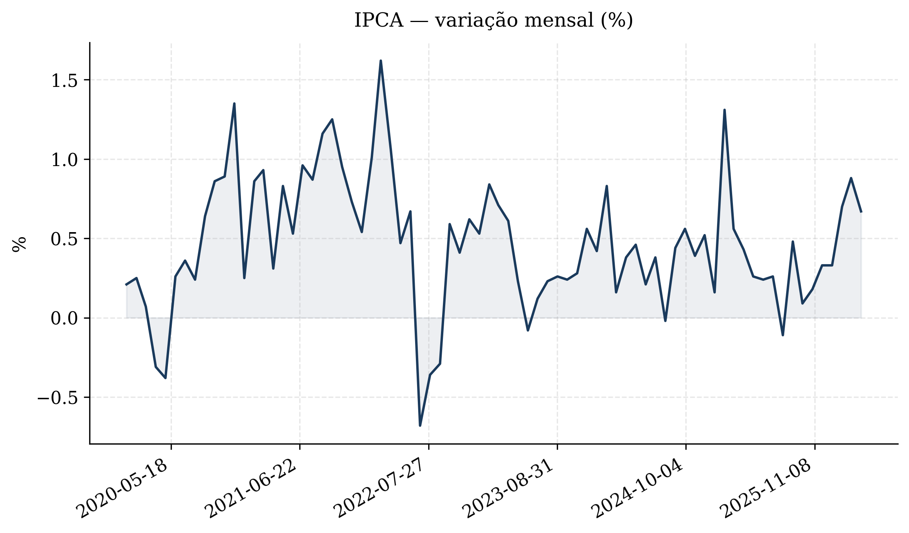
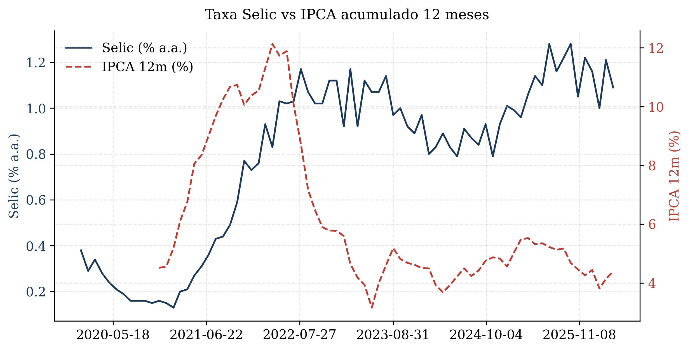

# DataEcon Notebook 📊

> Toolkit Python para coleta, análise e visualização de dados macroeconômicos do Brasil — com uma linha de código.

[](https://python.org)
[](https://jupyter.org)
[](https://www.bcb.gov.br)
[](https://sidra.ibge.gov.br)
[](LICENSE)

---

## O problema

Trabalhar com dados econômicos do Brasil envolve navegar entre portais de diferentes órgãos, lidar com formatos inconsistentes, converter tipos manualmente e reescrever o mesmo boilerplate a cada projeto. Este notebook resolve isso com funções reutilizáveis que abstraem toda essa complexidade.

---

## O que está incluído

| Módulo | Funcionalidade |
|--------|----------------|
| `bcb_serie()` | Baixa qualquer série do SGS/BCB por código |
| `bcb_multiplas()` | Baixa múltiplas séries e retorna DataFrame alinhado |
| `ibge_tabela()` | Acessa tabelas do IBGE/SIDRA por código |
| `ipca_acumulado()` | Calcula IPCA acumulado em N meses |
| `deflacionar()` | Converte série nominal → real usando IPCA |
| `variacao_anual()` | Variação percentual anual de série mensal |
| `resumo_estatistico()` | Estatísticas descritivas formatadas |
| `ols()` | Regressão OLS com erros robustos HC3 automático |
| `tabela_latex()` | Exporta múltiplas regressões em LaTeX (booktabs) |
| `adf_test()` | Teste ADF em nível e primeira diferença |
| `plot_serie()` | Série temporal com estilo acadêmico (300 DPI) |
| `plot_duplo()` | Dois eixos Y para séries em escalas diferentes |
| `plot_correlacao()` | Heatmap de correlação com anotações |
| `exportar()` | Salva dados em CSV e/ou Excel |

---

## Exemplo de uso

```python
# Baixar IPCA, Selic, câmbio e desemprego desde 2020
macro = bcb_multiplas(
    {'IPCA_mensal': 433, 'Selic': 4390, 'Cambio': 432, 'Desemprego': 24363},
    inicio='01/01/2020'
)

# Calcular IPCA acumulado 12 meses
macro['IPCA_12m'] = ipca_acumulado(macro['IPCA_mensal'], janela=12)

# Regressão OLS: Selic explicada por IPCA e câmbio
resultado = ols(macro, y='Selic', X=['IPCA_mensal', 'Cambio'])

# Exportar tabela para LaTeX (pronta para Overleaf)
print(tabela_latex([resultado], nomes=['(1)']))
```

---

## Outputs gerados

### Séries temporais

IPCA mensal (%) — série gerada diretamente da API do BCB com dados de 2020 a 2024.



Selic vs. IPCA acumulado 12 meses — dois eixos Y para séries em escalas diferentes.



### Matriz de correlação

Correlação entre indicadores macroeconômicos brasileiros (IPCA, Selic, câmbio, desemprego).

### Tabela de regressão (LaTeX)

```latex
\begin{table}[htbp]
\centering
\caption{Resultados das Regressões}
\begin{tabular}{lc}
\toprule
 & (1) \\
\midrule
const  & 12.3421*** \\
       & (1.2034)   \\
IPCA\_mensal & 0.8812** \\
       & (0.3201)   \\
Cambio & 0.4103*    \\
       & (0.2198)   \\
\midrule
Obs.   & 52         \\
$R^2$  & 0.681      \\
\bottomrule
\multicolumn{2}{l}{\small Erros padrão robustos (HC3) entre parênteses.}
\multicolumn{2}{l}{\small * p<0.10, ** p<0.05, *** p<0.01}
\end{tabular}
\end{table}
```

---

## Instalação

```bash
git clone https://github.com/henrinomics/dataecon-notebook.git
cd dataecon-notebook
pip install -r requirements.txt
jupyter notebook DataEcon_Notebook.ipynb
```

**Dependências:**

```
requests
pandas
numpy
matplotlib
statsmodels
scipy
seaborn
openpyxl
python-bcb
```

---

## Estrutura do repositório

```
dataecon-notebook/
│
├── DataEcon_Notebook.ipynb   # Notebook principal com outputs
├── requirements.txt          # Dependências
├── README.md                 # Este arquivo
│
├── outputs/
│   ├── ipca_mensal.png       # Gráfico IPCA
│   ├── selic_vs_ipca.png     # Gráfico Selic vs IPCA
│   ├── dados_macro_brasil.csv
│   └── tabela_regressao.tex
```

---

## Fontes de dados

- **BCB/SGS** — Sistema Gerenciador de Séries do Banco Central do Brasil  
  Documentação: https://www.bcb.gov.br/estatisticas/tabelaespecial

- **IBGE/SIDRA** — Sistema IBGE de Recuperação Automática  
  Documentação: https://apisidra.ibge.gov.br

Ambas as APIs são **públicas, gratuitas e sem necessidade de autenticação**.

---

## Referência rápida de séries BCB

| Código | Série | Periodicidade |
|--------|-------|---------------|
| 433 | IPCA (% ao mês) | Mensal |
| 13522 | IPCA acumulado 12 meses | Mensal |
| 4390 | Taxa Selic | Mensal |
| 432 | Câmbio BRL/USD (ptax) | Diária |
| 24363 | Taxa de desemprego (PNAD) | Mensal |
| 7326 | Dívida bruta (% PIB) | Mensal |
| 189 | IGP-M | Mensal |
| 21082 | Expectativa IPCA 12m (Focus) | Diária |

---

## Contexto

Projeto desenvolvido como parte do portfólio de Henrique Nomics, estudante de Ciências Econômicas com foco em econometria e análise de dados. O objetivo é criar ferramentas práticas que reduzam a fricção entre dados públicos e análises econômicas reproduzíveis.

---

## Licença

MIT — sinta-se livre para usar, modificar e distribuir.
